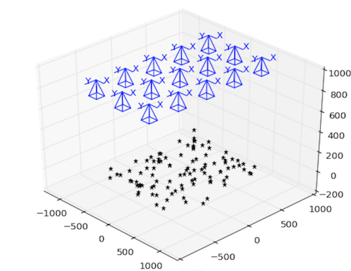

ImageProjectiveGeometry
=======================




## Installation

```
> Pkg.clone("https://github.com/peterkovesi/ImageProjectiveGeometry.jl.git")
```

Warning: While my demo tests seem to run OK a full test suite for
these functions is yet to be completed.

## Summary

This Image Projective Geometry package is intended as a starting point
for the development of a library of projective geometry functions for
computer vision.

Currently the package consists of a number of components which
ultimately could/should be separated off into individual packages or
contributed to other existing packages.  Also, some of these
functions, no doubt, duplicate existing functions in other packages
and these should be eventually rationalised.  However at this stage,
given that Julia and its packages are still subject to some change, I
have chosen to keep all these components in this package to minimise
external dependencies and make it as self contained as possible.

The components are:

1. **projective.jl:** Defines a camera structure, implements image
projection functions, functions for computing homographies and
fundamental matrices, stereo solution, etc.

2. **cornerfeatures.jl:** Implementations of a number of corner
detectors.  Ultimately could be contributed to the Images package.

3. **ransac.jl:** A generic implementation of RANSAC along with a
collection of specific functions that use RANAC for robust estimation
of homographies and fundamental matrices, and for fitting lines and
planes etc.

4. **transforms.jl:** Functions for constructing, applying, and decomposing
homogeneous transforms, angle-axis descriptors, and quaternions.

5. **utilities.jl:** Miscellaneous image processing functions
including nonmaximal suppression, image derivative computation and
efficient morphological dilation and erosion using rectangular and
octagonal structuring elements.  There is also a basic correlation
matcher.  Ultimately could be contributed to the Images package.

6. **ransacdemo.jl:** Functions demonstrating the use of ransac() to
fit lines, planes, fundamental matrices and homographies.


## Contribute

* There is much that is missing.  For example there is no code for
camera calibration, computation of trifocal tensors, or bundle
adjustment.  While there is code for detecting corners there is
nothing for matching them other than a basic correlation matcher,
though feature matching probably belongs in its own package(s)

* These functions are mostly ported from MATLAB code at
 [http://www.peterkovesi.com/matlabfns](http://www.peterkovesi.com/matlabfns/index.html)
 Accordingly some of the code is still MATLABesque in nature.  Pull
 requests to make it more Julian are welcome.

## Function Reference

* [projective](doc/projective.md)
* [cornerfeatures](doc/cornerfeatures.md)
* [ransac](doc/ransac.md)
* [transforms](doc/transforms.md)
* [utilities](doc/utilities.md)
* [ransacdemo](doc/ransacdemo.md)


## Supplementary Material

[The Fundamental Matrix Song](http://danielwedge.com/fmatrix/) by Daniel Wedge
[The RANSAC Song](http://danielwedge.com/ransac/) by Daniel Wedge

